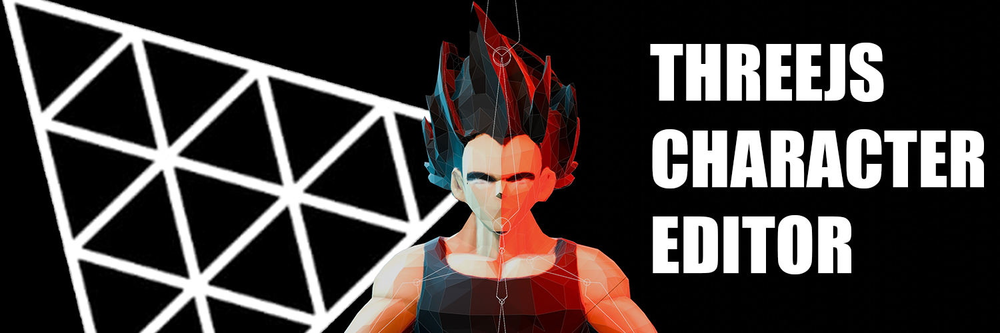

# Hi, I'm John. 👋

 
<i>Made with Blender and Three.js.</i>

## :point_right: Websites
 
**Portfolio:** https://www.renderfiction.com/ 
 
 
 
**"The 3D Linktree":** https://www.portalpixie.com/  
 
 
 
**Three.js Editor / 3D Character Tester:** https://render-fiction-editor-app.vercel.app/ 
 

## :point_right: Social Media
**X:** https://x.com/renderfiction 
**YouTube:** https://www.youtube.com/@renderfictionanimation 

## :point_right: Dev Experience
:boom: **Frontend:** HTML, CSS, Javascript, React, React Native, Next.js, Three.js 
:boom: **Backend:** Node.js, GraphQL/Apollo Server, MongoDB, Heroku 
